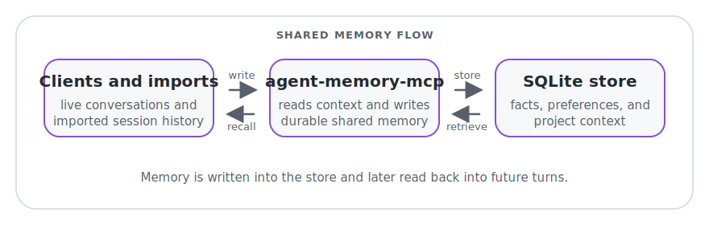

# agent-memory-mcp

`agent-memory-mcp` is a local MCP server that gives agents shared, durable memory stored in SQLite.

Default data path: `$HOME/.agent-memory/memory.db`.
Use the same `AGENT_MEMORY_HOME` across clients so Codex/Claude share one memory store.

`memory_search` is the default retrieval tool and is client-adaptive by default. Users should not need to prompt for `memory_search_compact` in normal Claude Code or Codex workflows.

## At a Glance

`agent-memory-mcp` sits between your agents and a shared local memory store. It lets each client read relevant context before a turn and write durable facts after a turn, so Codex, Claude Code, and importers all contribute to the same memory layer.



Optional embeddings can improve retrieval ranking.

## Distribution

This project is currently distributed via source/GitHub only.
NPM registry publishing is intentionally out of scope for this release.

## Release Model

A release for this project means:
- a versioned Git commit and annotated git tag
- a GitHub release with notes
- a validated source checkout where `npm install`, `npm run build`, and the documented runtime commands work as written

It does **not** mean npm registry publishing for the current release path.

## Quick Start (Shortcuts)

### 1) Install

```bash
git clone https://github.com/mikeylong/agent-memory-mcp.git
cd agent-memory-mcp
npm install
npm run build
```

### 2) Configure Codex + Xcode

Run the repo-local installer:

```bash
scripts/install-clients.sh
```

What it does:
- updates `~/.codex/config.toml` automatically
- updates `~/Library/Developer/Xcode/CodingAssistant/codex/config.toml` when that verified Xcode config directory already exists
- skips Xcode config and prints exact manual instructions when Xcode has not created its Codex config directory yet
- creates timestamped backups before editing existing config files
- writes config changes atomically so failed updates do not leave partial files behind

Useful installer flags:

```bash
scripts/install-clients.sh --dry-run
scripts/install-clients.sh --codex
scripts/install-clients.sh --xcode
scripts/install-clients.sh --agent-memory-home "$HOME/.agent-memory"
scripts/install-clients.sh --force
```

Optional npm wrapper:

```bash
npm run install:clients
```

Claude Code permissions tip:

If Claude Code keeps prompting for `agent-memory` tool permissions, allow the whole MCP server once in your Claude settings:

```json
{
  "permissions": {
    "allow": ["mcp__agent-memory"]
  }
}
```

This approves all tools from this server (including `memory_get_context` and `memory_capture`), which avoids repeated per-tool prompts.

### 3) Sanity check

Restart Codex and Xcode if they were already open, then call `memory_health` from your MCP client. Expected shape:

```json
{
  "ok": true,
  "db": "ok",
  "embeddings": "ok",
  "version": "0.2.0 (schema 1)",
  "retrieval_mode": "semantic+lexical",
  "embeddings_provider": "ollama",
  "embeddings_reason": "healthy",
  "actions": []
}
```

## Client Behavior

Use `memory_search` as the default retrieval path. The server shapes payload size by client type:

| Client | `memory_search` behavior |
|---|---|
| Claude Code / Codex | Preferred default; rich defaults with no forced compact caps |
| Unknown clients | Adaptive retry: rich first, compact-safe fallback when envelope is too large |

`memory_search_compact` remains available as a fallback endpoint for strict payload-limit environments, explicit compact-mode requests, or manual troubleshooting. It should not be the default choice for Claude Code or Codex.

### 4) Start wrapper shortcuts (Codex + legacy Claude)

```bash
scripts/codex-memory.sh "$HOME/projects/agent-memory"
scripts/claude-memory.sh "$HOME/projects/agent-memory"
```

`session_id` is optional in shortcut scripts. If omitted, one is auto-generated.
`scripts/claude-memory.sh` is a legacy `claude -p` fallback path.

### 4b) Enable Claude interactive hooks (default recommended path)

```bash
npm run enable:claude-wrapper
source ~/.zshrc
```

After this, plain `claude` stays in native interactive UX, and memory enforcement runs via
Claude hooks on every turn (`UserPromptSubmit` + `Stop`).

Behavior notes:
- fail-open: Claude turn still proceeds if hook memory read/write fails
- slash commands (for example `/mcp`, `/model`) are not captured as memories
- previous shell wrapper interception (`claude()` -> `claude -p`) is removed

### 5) Import latest sessions (auto-discovery)

```bash
scripts/import-codex-session.sh --project-path "$HOME/projects/agent-memory"
scripts/import-claude-session.sh --project-path "$HOME/projects/agent-memory"
```

### 6) First-run embeddings behavior

- `agent-memory-mcp` does **not** auto-install Ollama.
- If Ollama is unavailable, the server still works in lexical-only mode and `memory_health` reports degraded embeddings with actionable `actions`.
- To enable semantic embeddings:
  - Start Ollama and ensure `AGENT_MEMORY_OLLAMA_URL` points to a reachable endpoint (default `http://127.0.0.1:11434`).
  - Ensure `AGENT_MEMORY_EMBED_MODEL` is available in Ollama (default `nomic-embed-text`).
- To run intentionally without embeddings, set `AGENT_MEMORY_DISABLE_EMBEDDINGS=1`.

## Common Tasks (Shortcuts)

| Task | Command |
|---|---|
| Install Codex + Xcode client config | `scripts/install-clients.sh` |
| Dry-run installer | `scripts/install-clients.sh --dry-run` |
| Start Codex with enforced memory | `scripts/codex-memory.sh "$HOME/projects/agent-memory"` |
| Enable Claude hooks (recommended) | `npm run enable:claude-wrapper && source ~/.zshrc` |
| Start Claude chat with enforced memory (interactive mode) | `claude` |
| Legacy Claude print-wrapper fallback | `scripts/claude-memory.sh "$HOME/projects/agent-memory"` |
| Import latest Codex session | `scripts/import-codex-session.sh --project-path "$HOME/projects/agent-memory"` |
| Import latest Claude session | `scripts/import-claude-session.sh --project-path "$HOME/projects/agent-memory"` |
| Import a specific Codex session file | `scripts/import-codex-session.sh --session-file "$HOME/.codex/sessions/YYYY/MM/DD/rollout-<id>.jsonl" --project-path "$HOME/projects/agent-memory"` |
| Import a specific Claude session file | `scripts/import-claude-session.sh --session-file "$HOME/.claude/projects/<workspace-slug>/<session-id>.jsonl" --project-path "$HOME/projects/agent-memory"` |
| Import into session scope | `scripts/import-codex-session.sh --scope session --session-id replay-01` |

Importer shortcut flags (both scripts):
- `--session-file <path>` optional override
- `--project-path <path>` default `pwd`
- `--scope <project|global|session>` default `project`
- `--session-id <id>` only when `--scope session`
- `--max-facts <n>` default `25`
- `-h|--help`

## Cross-Agent Verification

1. In one client, write a fact with `memory_upsert`.
2. In another client, retrieve it with `memory_search`.
3. Confirm both clients return the same fact from shared local storage.

## Canonical Preferences

- `memory_upsert` idempotency key behavior:
  - same key + same effective payload (same scope + redacted content hash) returns the existing row (`created: false`)
  - same key + changed payload is treated as latest-write-wins; the idempotency key is remapped to the latest row
- Canonical preference memories now enforce **last-write-wins** per `(scope_type, scope_id, canonical_key)`.
- Canonical key resolution order on write:
  - `metadata.normalized_key` (if provided)
  - idempotency-key fallback when tags are preference-intent and key normalizes to `favorite_*`
  - inferred from content when tags are preference-intent and content matches:
    - `Favorite <subject>: <value>`
    - `Canonical user preference: favorite <subject> is <value>`
- When a canonical key is resolved, the upsert response may include:
  - `canonical_key`
  - `replaced_ids` (soft-deleted prior active canonical entries for that key/scope)
- For preference-intent `memory_get_context` queries (for example, “what is my favorite notebook cover color?”):
  - active canonical memories are prioritized first
  - duplicate canonical keys use scope tie-break `session > project > global`, then recency
  - captured dialogue-like rows (`User:`/`Assistant:` with `metadata.captured=true`) are excluded from the remainder when canonical winners are found
- `memory_get_context` supports temporal preference prompts (for example, “what used to be my favorite zebra color?”) and may return `canonical_timeline` with active and prior values.
- Runtime freshness for manual tests:
  - Claude hooks and MCP runtime execute `dist/*`, not `src/*`
  - after source changes, run `npm run build` and restart affected clients/hooks before validating behavior
  - stale `dist` can produce false negatives (for example, old idempotency/canonical logic still active)

## Advanced

### Manual MCP configuration fallback

If you do not want the installer to edit client config files, add this MCP server entry yourself.
Use the current `node` executable on your machine if GUI apps need an absolute path.

```toml
[mcp_servers.agent-memory]
command = "/absolute/path/to/node"
args = ["/absolute/path/to/agent-memory-mcp/dist/index.js"]
enabled = true

[mcp_servers.agent-memory.env]
AGENT_MEMORY_HOME = "/absolute/path/to/.agent-memory"
```

Codex target path:
- `~/.codex/config.toml`

Xcode target path:
- `~/Library/Developer/Xcode/CodingAssistant/codex/config.toml`

Xcode notes:
- the installer patches the Xcode config only when that directory already exists, unless you pass `--force`
- if Xcode has not created its Coding Assistant config yet, open Xcode and launch the Coding Assistant/Codex flow once, then rerun the installer
- if your Xcode build exposes MCP settings only through UI on this machine, use the same server payload there

### Installer Troubleshooting

- If Xcode has never configured Codex, `~/Library/Developer/Xcode/CodingAssistant/codex` may not exist yet. In that case the installer skips Xcode by default, prints the exact MCP block, and tells you to open Xcode Coding Assistant/Codex once before rerunning.
- If a config file is read-only or not writable, the installer exits with a path-specific permission error instead of modifying it partially.
- If the installer detects multiple `agent-memory` sections or another unsupported existing shape, it does not rewrite the file. It prints the manual MCP block so you can reconcile the file yourself.
- If a write fails after rendering the next config, the installer keeps the original file in place and reports which step failed.
- Codex keeps `command = "node"` for compatibility with the current config style. Xcode uses an absolute Node path because GUI-launched apps may not inherit the same shell `PATH`.

### Raw server start

```bash
node dist/index.js
```

### Raw wrapper commands

```bash
node dist/wrapper.js --codex --project-path "$HOME/projects/agent-memory" --session-id my-session
node dist/wrapper.js --claude --project-path "$HOME/projects/agent-memory" --session-id my-session
```

`--claude` above is a legacy print-wrapper path (`claude -p`). Prefer hook-based Claude setup via `npm run enable:claude-wrapper`.

`my-session` above is an example session id label. Use any string you want, or omit `--session-id` when using shortcut scripts.
Add `--debug` to print per-turn memory read/write operations (get-context, upsert, capture).

### Raw importer commands

```bash
node dist/importCodexSession.js \
  --session-file "$HOME/.codex/sessions/YYYY/MM/DD/rollout-<id>.jsonl" \
  --project-path "$HOME/projects/agent-memory" \
  --scope project \
  --max-facts 25

node dist/importClaudeSession.js \
  --session-file "$HOME/.claude/projects/<workspace-slug>/<session-id>.jsonl" \
  --project-path "$HOME/projects/agent-memory" \
  --scope project \
  --max-facts 25

node dist/importChatgptExport.js \
  --export-zip "$HOME/Downloads/ChatGPT Data Download.zip" \
  --capture-scope global \
  --branch-strategy active \
  --coverage all \
  --max-facts 5
```

### Importer binaries

```bash
agent-memory-import-codex --session-file "$HOME/.codex/sessions/YYYY/MM/DD/rollout-<id>.jsonl"
agent-memory-import-claude --session-file "$HOME/.claude/projects/<workspace-slug>/<session-id>.jsonl"
```

### Optional npm convenience commands

```bash
npm run import:codex:latest -- --project-path "$HOME/projects/agent-memory"
npm run import:claude:latest -- --project-path "$HOME/projects/agent-memory"
```

## Release Checklist

Before cutting the next GitHub/source release:

1. Confirm the git worktree is clean.
2. Decide the version bump and update release notes.
3. Run `npm run release:check`.
4. Create an annotated tag for the release version.
5. Publish the GitHub release notes.
6. State explicitly in the release notes that npm publish is out of scope for this release.

### Optional client-class override (testing/ops)

```bash
AGENT_MEMORY_CLIENT_CLASS_OVERRIDE=constrained node dist/index.js
```

Allowed values: `auto` (default), `rich`, `constrained`, `unknown`.

## Limitations

- Embeddings are optional; lexical retrieval still works when embeddings are unavailable.
- Transport is stdio in v1.
- Redaction is heuristic and not a full DLP system.

## Contributing

```bash
npm run privacy:scan
npm run build
npm test
```

## License

MIT.
